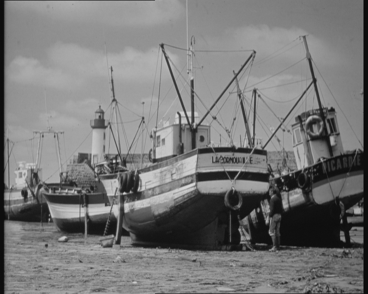

# Testing Various Markdown Features


## Including Images

Size specifications are ignored in Github markdown:<br>


Use of plain HTLM works OK:<br>


## Java Syntax Highlighting

```java
ImageProcessor ip = ... // any image
GenericFilter filter = new TschumperleDericheFilter();
try (ProgressMonitor m = new ProgressBarMonitor(filter)) {
    filter.applyTo(ip);
}
```

## Math rendering

When $a \ne 0$, there are two solutions to $(ax^2 + bx + c = 0)$ and they are 
$$x = {-b \pm \sqrt{b^2-4ac} \over 2a}$$
Note that NO space or newline may be inserted after `$$` in display mode.
